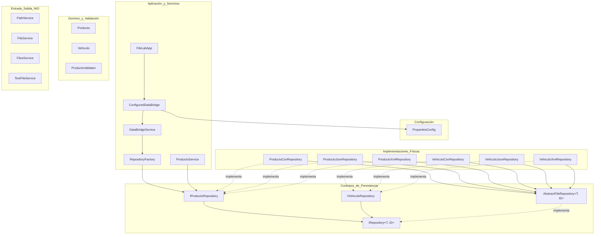

# Guía Maestra de Desarrollo — FileLab (Java 21)

Esta guía explica en detalle **qué es el proyecto, para qué sirve, su arquitectura, dónde se sitúa cada clase** y una **hoja de ruta paso a paso** con explicaciones y código de referencia para completar todos los métodos pendientes y obtener la máxima calificación (10/10).

---

## Índice

1. [Visión General del Proyecto](#1-visión-general-del-proyecto)
2. [Arquitectura del Sistema y Mapa de Clases](#2-arquitectura-del-sistema-y-mapa-de-clases)
3. [Reglas de Oro de Implementación](#3-reglas-de-oro-de-implementación)
4. [Paso a Paso: Guía de Implementación por Bloques](#4-paso-a-paso-guía-de-implementación-por-bloques)
   - [Bloque 1 · Rutas con PathService](#bloque-1--rutas-con-pathservice)
   - [Bloque 2 · Ficheros clásicos con FileService](#bloque-2--ficheros-clásicos-con-fileservice)
   - [Bloque 3 · Operaciones de E/S con FilesService](#bloque-3--operaciones-de-es-con-filesservice)
   - [Bloque 4 · Ficheros de texto con TextFileService](#bloque-4--ficheros-de-texto-con-textfileservice)
   - [Bloque 5 · Validación de Dominio con ProductoValidator](#bloque-5--validación-de-dominio-con-productovalidator)
   - [Bloque 6 · Lógica de Negocio con ProductoService](#bloque-6--lógica-de-negocio-con-productoservice)
   - [Bloque 7 · Repositorio Genérico y Patrón Plantilla con AbstractFileRepository](#bloque-7--repositorio-genérico-y-patrón-plantilla-con-abstractfilerepository)
   - [Bloque 8 · Persistencia CSV con ProductoCsvRepository](#bloque-8--persistencia-csv-con-productocsvrepository)
   - [Bloque 9 · Persistencia JSON con ProductoJsonRepository](#bloque-9--persistencia-json-con-productojsonrepository)
   - [Bloque 10 · Persistencia XML con DocumentoProductos y ProductoXmlRepository](#bloque-10--persistencia-xml-con-documentoproductos-y-productoxmlrepository)
   - [Bloque 11 · Generalización con Vehiculo](#bloque-11--generalización-con-vehiculo)
   - [Bloque 12 · Configuración con PropertiesConfig](#bloque-12--configuración-con-propertiesconfig)
   - [Bloque 13 · Factoría de Repositorios con FileFormat y RepositoryFactory](#bloque-13--factoría-de-repositorios-con-fileformat-y-repositoryfactory)
   - [Bloque 14 · Migración entre Formatos con DataBridgeService y ConfiguredDataBridge](#bloque-14--migración-entre-formatos-con-databridgeservice-y-configureddatabridge)
5. [Documentación JavaDoc de IRepository (2.0 puntos)](#5-documentación-javadoc-de-irepository-20-puntos)
6. [Flujo de Verificación y Cálculo de Nota](#6-flujo-de-verificación-y-cálculo-de-nota)
7. [Checklist Final de Entrega](#7-checklist-final-de-entrega)

---

## 1. Visión General del Proyecto

### ¿Qué es FileLab?
**FileLab** es un proyecto práctico diseñado en **Java 21** para aprender y aplicar en profundidad:
1. Las APIs modernas de entrada/salida: **Java NIO.2** (`java.nio.file.Path`, `java.nio.file.Files`) frente a la API clásica (`java.io.File`).
2. Persistencia estructurada en disco sin depender de motores de bases de datos relacionales o NoSQL:
   - Ficheros planos y texto en codificación **UTF-8**.
   - Ficheros tabulares **CSV** mediante la librería [Apache Commons CSV](https://commons.apache.org/proper/commons-csv/).
   - Ficheros jerárquicos **JSON** mediante [Jackson Databind](https://github.com/FasterXML/jackson-databind).
   - Ficheros **XML** estructurados mediante [Jackson Dataformat XML](https://github.com/FasterXML/jackson-dataformat-xml).
   - Ficheros de propiedades de configuración **`.properties`** mediante `java.util.Properties`.
3. Patrones de arquitectura limpia:
   - **Repository Pattern** genérico (`IRepository<T, ID>`) para abstraer el almacenamiento de las entidades.
   - **Template Method Pattern** (`AbstractFileRepository<T, ID>`) para centralizar las operaciones CRUD comunes (crear, buscar, actualizar, borrar) y evitar duplicidad de código.
   - **Factory Pattern** (`RepositoryFactory`) para instanciar repositorios dinámicamente según el formato deseado.
   - **Bridge / Service Orchestration** (`DataBridgeService`) para transferir y convertir datos entre formatos sin acoplamiento.

### ¿Para qué sirve?
Resuelve una necesidad crítica en el desarrollo de software: **la interoperabilidad y migración de datos**. Una aplicación comercial necesita frecuentemente importar productos desde un archivo CSV proporcionado por un proveedor, procesar los datos de inventario con reglas de negocio, y exportarlos en JSON para una API web o en XML para un sistema ERP empresarial, todo ello sin que la lógica analítica o de negocio conozca el formato físico subyacente.

---

## 2. Arquitectura del Sistema y Mapa de Clases

El proyecto está organizado en paquetes claramente diferenciados según su responsabilidad (*Single Responsibility Principle*):



### Tabla Completa de Clases y su Ubicación

| Paquete | Clase / Fichero | Responsabilidad y Para qué sirve |
| :--- | :--- | :--- |
| `model` | [`Producto.java`](file:///home/alumno/Escritorio/file-lab-alumnado/src/main/java/es/codelearnacademy/filelab/model/Producto.java) | `record` inmutable con los atributos `id`, `nombre`, `precio`, `stock`. Representa la entidad central del negocio. |
| `model` | [`Vehiculo.java`](file:///home/alumno/Escritorio/file-lab-alumnado/src/main/java/es/codelearnacademy/filelab/model/Vehiculo.java) | `record` inmutable con `matricula`, `marca`, `modelo`, `anio`. Demuestra que el repositorio soporta identificadores `String` y distintas entidades. |
| `validation` | [`ProductoValidator.java`](file:///home/alumno/Escritorio/file-lab-alumnado/src/main/java/es/codelearnacademy/filelab/validation/ProductoValidator.java) | Clase utilitaria con método `validar(Producto)`. Garantiza las invariantes de negocio (no nulo, id > 0, precio >= 0, stock >= 0). |
| `io` | [`PathService.java`](file:///home/alumno/Escritorio/file-lab-alumnado/src/main/java/es/codelearnacademy/filelab/io/PathService.java) | Manipulación y análisis sintáctico de rutas en memoria (`java.nio.file.Path`): crear, normalizar, resolver, extensiones. |
| `io` | [`FileService.java`](file:///home/alumno/Escritorio/file-lab-alumnado/src/main/java/es/codelearnacademy/filelab/io/FileService.java) | Operaciones con el `java.io.File` clásico e interoperabilidad bidireccional con `Path`. |
| `io` | [`FilesService.java`](file:///home/alumno/Escritorio/file-lab-alumnado/src/main/java/es/codelearnacademy/filelab/io/FilesService.java) | Operaciones físicas en disco (`Files.createDirectory`, `createFile`, `copy`, `move`, `delete`, `size`) sin fugar excepciones. |
| `io` | [`TextFileService.java`](file:///home/alumno/Escritorio/file-lab-alumnado/src/main/java/es/codelearnacademy/filelab/io/TextFileService.java) | Lectura y escritura de contenido textual completo y por líneas en UTF-8 utilizando `Files`. |
| `repository` | [`IRepository.java`](file:///home/alumno/Escritorio/file-lab-alumnado/src/main/java/es/codelearnacademy/filelab/repository/IRepository.java) | Interfaz genérica `IRepository<T, ID>` que define el contrato CRUD estándar (`findAll`, `findById`, `create`, `update`, `delete`). Debe tener JavaDoc completo. |
| `repository` | [`IProductoRepository.java`](file:///home/alumno/Escritorio/file-lab-alumnado/src/main/java/es/codelearnacademy/filelab/repository/IProductoRepository.java) | Especialización de `IRepository<Producto, Long>`. Desacopla la lógica de negocio de los ficheros físicos. |
| `repository` | [`IVehiculoRepository.java`](file:///home/alumno/Escritorio/file-lab-alumnado/src/main/java/es/codelearnacademy/filelab/repository/IVehiculoRepository.java) | Especialización de `IRepository<Vehiculo, String>`. |
| `repository` | [`AbstractFileRepository.java`](file:///home/alumno/Escritorio/file-lab-alumnado/src/main/java/es/codelearnacademy/filelab/repository/AbstractFileRepository.java) | Clase abstracta con el patrón **Template Method**. Implementa la lógica común CRUD delegando la lectura y escritura física a métodos abstractos `readAll()`, `writeAll()` y `getId()`. |
| `csv` | [`ProductoCsvRepository.java`](file:///home/alumno/Escritorio/file-lab-alumnado/src/main/java/es/codelearnacademy/filelab/csv/ProductoCsvRepository.java) | Implementación de persistencia de productos en formato CSV con Apache Commons CSV. |
| `csv` | [`VehiculoCsvRepository.java`](file:///home/alumno/Escritorio/file-lab-alumnado/src/main/java/es/codelearnacademy/filelab/csv/VehiculoCsvRepository.java) | Implementación de persistencia de vehículos en formato CSV con Apache Commons CSV. |
| `json` | [`ProductoJsonRepository.java`](file:///home/alumno/Escritorio/file-lab-alumnado/src/main/java/es/codelearnacademy/filelab/json/ProductoJsonRepository.java) | Implementación de persistencia de productos en formato JSON mediante Jackson `ObjectMapper`. |
| `json` | [`VehiculoJsonRepository.java`](file:///home/alumno/Escritorio/file-lab-alumnado/src/main/java/es/codelearnacademy/filelab/json/VehiculoJsonRepository.java) | Implementación de persistencia de vehículos en formato JSON mediante Jackson `ObjectMapper`. |
| `xml` | [`DocumentoProductos.java`](file:///home/alumno/Escritorio/file-lab-alumnado/src/main/java/es/codelearnacademy/filelab/xml/DocumentoProductos.java) | DTO raíz anotado con Jackson XML (`<productos>`) que envuelve la lista de `<producto>`. |
| `xml` | [`ProductoXmlRepository.java`](file:///home/alumno/Escritorio/file-lab-alumnado/src/main/java/es/codelearnacademy/filelab/xml/ProductoXmlRepository.java) | Implementación de persistencia de productos en formato XML usando Jackson `XmlMapper` y `DocumentoProductos`. |
| `xml` | [`DocumentoVehiculos.java`](file:///home/alumno/Escritorio/file-lab-alumnado/src/main/java/es/codelearnacademy/filelab/xml/DocumentoVehiculos.java) | DTO raíz anotado con Jackson XML (`<vehiculos>`) que envuelve la lista de `<vehiculo>`. |
| `xml` | [`VehiculoXmlRepository.java`](file:///home/alumno/Escritorio/file-lab-alumnado/src/main/java/es/codelearnacademy/filelab/xml/VehiculoXmlRepository.java) | Implementación de persistencia de vehículos en formato XML usando Jackson `XmlMapper` y `DocumentoVehiculos`. |
| `config` | [`PropertiesConfig.java`](file:///home/alumno/Escritorio/file-lab-alumnado/src/main/java/es/codelearnacademy/filelab/config/PropertiesConfig.java) | Gestor de configuración que lee, modifica y almacena pares clave-valor en ficheros `.properties`. |
| `service` | [`ProductoService.java`](file:///home/alumno/Escritorio/file-lab-alumnado/src/main/java/es/codelearnacademy/filelab/service/ProductoService.java) | Servicios analíticos sobre productos (búsqueda, producto más caro/barato, stock total, valoración del inventario) usando la Stream API de Java. |
| `service` | [`FileFormat.java`](file:///home/alumno/Escritorio/file-lab-alumnado/src/main/java/es/codelearnacademy/filelab/service/FileFormat.java) | Enum (`CSV`, `JSON`, `XML`) con método de conversión insensible a mayúsculas/minúsculas. |
| `service` | [`RepositoryFactory.java`](file:///home/alumno/Escritorio/file-lab-alumnado/src/main/java/es/codelearnacademy/filelab/service/RepositoryFactory.java) | Factoría para instanciar el `IProductoRepository` correcto según el `FileFormat`. |
| `service` | [`DataBridgeService.java`](file:///home/alumno/Escritorio/file-lab-alumnado/src/main/java/es/codelearnacademy/filelab/service/DataBridgeService.java) | Orquesta la conversión y migración de datos entre un fichero origen y uno destino mediante repositorios. |
| `service` | [`ConfiguredDataBridge.java`](file:///home/alumno/Escritorio/file-lab-alumnado/src/main/java/es/codelearnacademy/filelab/service/ConfiguredDataBridge.java) | Lee la configuración desde `PropertiesConfig` y ejecuta la migración mediante `DataBridgeService`. |
| `app` | [`FileLabApp.java`](file:///home/alumno/Escritorio/file-lab-alumnado/src/main/java/es/codelearnacademy/filelab/app/FileLabApp.java) | Punto de entrada ejecutable `public static void main(String[] args)`. |

---

## 3. Reglas de Oro de Implementación

Antes de escribir código, ten siempre presentes estas directrices arquitectónicas:

1. **Las APIs públicas NO declaran `throws IOException`**:
   Las excepciones físicas de E/S deben capturarse dentro de los métodos. Cuando algo falla o no se encuentra el archivo, el método debe retornar un valor vacío seguro:
   - `Optional<T>` $\rightarrow$ `Optional.empty()`
   - `List<T>` $\rightarrow$ `List.of()`
   - `Map<K, V>` $\rightarrow$ `Map.of()`
   - `String` $\rightarrow$ `""`
   - `OptionalLong` $\rightarrow$ `OptionalLong.empty()`
   - `boolean` $\rightarrow$ `false`
2. **Métodos `protected` de bajo nivel**:
   Los métodos `protected abstract List<T> readAll() throws IOException` y `protected abstract void writeAll(List<T> entities) throws IOException` sí declaran `throws IOException`. Esto permite que la clase base [`AbstractFileRepository`](file:///home/alumno/Escritorio/file-lab-alumnado/src/main/java/es/codelearnacademy/filelab/repository/AbstractFileRepository.java) capture la excepción y unifique la respuesta de error para todos los formatos.
3. **Validaciones de dominio**:
   A diferencia de la E/S, las validaciones de negocio en [`ProductoValidator`](file:///home/alumno/Escritorio/file-lab-alumnado/src/main/java/es/codelearnacademy/filelab/validation/ProductoValidator.java) **sí deben lanzar `IllegalArgumentException`** cuando los datos no sean válidos.
4. **No modificar los tests**:
   Los tests unitarios no deben alterarse bajo ninguna circunstancia.

---

## 4. Paso a Paso: Guía de Implementación por Bloques

Sigue este orden secuencial para completar cada bloque y pasar los tests uno a uno.

---

### Bloque 1 · Rutas con PathService

- **Clase:** [`PathService.java`](file:///home/alumno/Escritorio/file-lab-alumnado/src/main/java/es/codelearnacademy/filelab/io/PathService.java)
- **Concepto clave:** La interfaz `Path` (Java NIO.2) representa rutas en el sistema de archivos de forma independiente del sistema operativo. Las operaciones no acceden al disco, solo manipulan la ruta sintácticamente.

#### Métodos a implementar y código de referencia:

1. **`crear(String primero, String... partes)`**: Usa `Path.of(primero, partes)`. No concatenes barras manualmente.
2. **`nombre(Path path)`**: Retorna `path.getFileName().toString()`.
3. **`padre(Path path)`**: Retorna `path.getParent()`.
4. **`absoluto(Path path)`**: Retorna `path.toAbsolutePath()`.
5. **`normalizar(Path path)`**: Retorna `path.normalize()`, resolviendo `.` y `..`.
6. **`esAbsoluto(Path path)`**: Retorna `path.isAbsolute()`.
7. **`resolver(Path base, String otro)`**: Retorna `base.resolve(otro)`.
8. **`relativizar(Path base, Path destino)`**: Retorna `base.relativize(destino)`.
9. **`extension(Path path)`**:
   Obtén el nombre del fichero (`path.getFileName().toString()`). Busca la última posición del punto `int dotIndex = name.lastIndexOf('.')`. Si no hay punto (`dotIndex <= 0`) o el punto es el último carácter (`dotIndex == name.length() - 1`), devuelve `""`. En caso contrario, devuelve `name.substring(dotIndex + 1)`.

```java
// Implementación de referencia para PathService.java
package es.codelearnacademy.filelab.io;

import java.nio.file.Path;

public class PathService {

    public Path crear(String primero, String... partes) {
        return Path.of(primero, partes);
    }

    public String nombre(Path path) {
        return path.getFileName() != null ? path.getFileName().toString() : "";
    }

    public Path padre(Path path) {
        return path.getParent();
    }

    public Path absoluto(Path path) {
        return path.toAbsolutePath();
    }

    public Path normalizar(Path path) {
        return path.normalize();
    }

    public boolean esAbsoluto(Path path) {
        return path.isAbsolute();
    }

    public Path resolver(Path base, String otro) {
        return base.resolve(otro);
    }

    public Path relativizar(Path base, Path destino) {
        return base.relativize(destino);
    }

    public String extension(Path path) {
        if (path == null || path.getFileName() == null) {
            return "";
        }
        String fileName = path.getFileName().toString();
        int dotIndex = fileName.lastIndexOf('.');
        if (dotIndex <= 0 || dotIndex == fileName.length() - 1) {
            return "";
        }
        return fileName.substring(dotIndex + 1);
    }
}
```

#### Comando de verificación:
```bash
mvn -Dtest=PathServiceTest test
```

---

### Bloque 2 · Ficheros clásicos con FileService

- **Clase:** [`FileService.java`](file:///home/alumno/Escritorio/file-lab-alumnado/src/main/java/es/codelearnacademy/filelab/io/FileService.java)
- **Concepto clave:** Manejo de la clase tradicional `java.io.File` y su conversión hacia y desde `Path`.

#### Métodos a implementar y código de referencia:
1. **`existe(File file)`**: `file != null && file.exists()`
2. **`esArchivo(File file)`**: `file != null && file.isFile()`
3. **`esDirectorio(File file)`**: `file != null && file.isDirectory()`
4. **`nombre(File file)`**: `file.getName()`
5. **`padre(File file)`**: `file.getParentFile()`
6. **`convertirAPath(File file)`**: `file.toPath()`
7. **`convertirAFile(Path path)`**: `path.toFile()`

```java
// Implementación de referencia para FileService.java
package es.codelearnacademy.filelab.io;

import java.io.File;
import java.nio.file.Path;

public class FileService {

    public boolean existe(File file) {
        return file != null && file.exists();
    }

    public boolean esArchivo(File file) {
        return file != null && file.isFile();
    }

    public boolean esDirectorio(File file) {
        return file != null && file.isDirectory();
    }

    public String nombre(File file) {
        return file != null ? file.getName() : "";
    }

    public File padre(File file) {
        return file != null ? file.getParentFile() : null;
    }

    public Path convertirAPath(File file) {
        return file.toPath();
    }

    public File convertirAFile(Path path) {
        return path.toFile();
    }
}
```

#### Comando de verificación:
```bash
mvn -Dtest=FileServiceTest test
```

---

### Bloque 3 · Operaciones de E/S con FilesService

- **Clase:** [`FilesService.java`](file:///home/alumno/Escritorio/file-lab-alumnado/src/main/java/es/codelearnacademy/filelab/io/FilesService.java)
- **Concepto clave:** Operaciones sobre el sistema de archivos real con `java.nio.file.Files`. Ningún método debe lanzar `IOException`; todas deben capturarse internamente y devolver `Optional`, `OptionalLong` o `boolean`.

#### Métodos a implementar y código de referencia:
1. **`existe(Path path)`**: `Files.exists(path)`
2. **`crearDirectorio(Path path)`**: Envuelto en `try-catch (IOException)` $\rightarrow$ `Optional.of(Files.createDirectory(path))` o `Optional.empty()`.
3. **`crearDirectorios(Path path)`**: Envuelto en `try-catch` $\rightarrow$ `Optional.of(Files.createDirectories(path))` o `Optional.empty()`.
4. **`crearArchivo(Path path)`**: Envuelto en `try-catch` $\rightarrow$ `Optional.of(Files.createFile(path))` o `Optional.empty()`.
5. **`copiar(Path origen, Path destino)`**: `Files.copy(origen, destino, StandardCopyOption.REPLACE_EXISTING)`. Retorna `Optional.of(destino)` si va bien.
6. **`mover(Path origen, Path destino)`**: `Files.move(origen, destino, StandardCopyOption.REPLACE_EXISTING)`. Retorna `Optional.of(destino)` si va bien.
7. **`eliminar(Path path)`**: `Files.deleteIfExists(path)` en `try-catch`.
8. **`tamanio(Path path)`**: `OptionalLong.of(Files.size(path))` en `try-catch`. Si falla o no existe, `OptionalLong.empty()`.

```java
// Implementación de referencia para FilesService.java
package es.codelearnacademy.filelab.io;

import java.io.IOException;
import java.nio.file.Files;
import java.nio.file.Path;
import java.nio.file.StandardCopyOption;
import java.util.Optional;
import java.util.OptionalLong;

public class FilesService {

    public boolean existe(Path path) {
        return path != null && Files.exists(path);
    }

    public Optional<Path> crearDirectorio(Path path) {
        try {
            return Optional.of(Files.createDirectory(path));
        } catch (IOException e) {
            return Optional.empty();
        }
    }

    public Optional<Path> crearDirectorios(Path path) {
        try {
            return Optional.of(Files.createDirectories(path));
        } catch (IOException e) {
            return Optional.empty();
        }
    }

    public Optional<Path> crearArchivo(Path path) {
        try {
            return Optional.of(Files.createFile(path));
        } catch (IOException e) {
            return Optional.empty();
        }
    }

    public Optional<Path> copiar(Path origen, Path destino) {
        try {
            Files.copy(origen, destino, StandardCopyOption.REPLACE_EXISTING);
            return Optional.of(destino);
        } catch (IOException e) {
            return Optional.empty();
        }
    }

    public Optional<Path> mover(Path origen, Path destino) {
        try {
            Files.move(origen, destino, StandardCopyOption.REPLACE_EXISTING);
            return Optional.of(destino);
        } catch (IOException e) {
            return Optional.empty();
        }
    }

    public boolean eliminar(Path path) {
        try {
            return Files.deleteIfExists(path);
        } catch (IOException e) {
            return false;
        }
    }

    public OptionalLong tamanio(Path path) {
        try {
            return OptionalLong.of(Files.size(path));
        } catch (IOException e) {
            return OptionalLong.empty();
        }
    }
}
```

#### Comando de verificación:
```bash
mvn -Dtest=FilesServiceTest test
```

---

### Bloque 4 · Ficheros de texto con TextFileService

- **Clase:** [`TextFileService.java`](file:///home/alumno/Escritorio/file-lab-alumnado/src/main/java/es/codelearnacademy/filelab/io/TextFileService.java)
- **Concepto clave:** Lectura y escritura de cadenas y líneas asegurando codificación **UTF-8**.

#### Métodos a implementar y código de referencia:
1. **`escribir(Path path, String contenido)`**: `Files.writeString(path, contenido, StandardCharsets.UTF_8)` devolviendo `true` o `false`.
2. **`leer(Path path)`**: `Files.readString(path, StandardCharsets.UTF_8)` devolviendo el string o `""` ante error.
3. **`escribirLineas(Path path, List<String> lineas)`**: `Files.write(path, lineas, StandardCharsets.UTF_8)` devolviendo `true` o `false`.
4. **`leerLineas(Path path)`**: `Files.readAllLines(path, StandardCharsets.UTF_8)` devolviendo la lista o `List.of()` ante error.
5. **`anexar(Path path, String contenido)`**: `Files.writeString(path, contenido, StandardCharsets.UTF_8, StandardOpenOption.CREATE, StandardOpenOption.APPEND)`.

```java
// Implementación de referencia para TextFileService.java
package es.codelearnacademy.filelab.io;

import java.io.IOException;
import java.nio.charset.StandardCharsets;
import java.nio.file.Files;
import java.nio.file.Path;
import java.nio.file.StandardOpenOption;
import java.util.List;

public class TextFileService {

    public boolean escribir(Path path, String contenido) {
        try {
            Files.writeString(path, contenido, StandardCharsets.UTF_8);
            return true;
        } catch (IOException e) {
            return false;
        }
    }

    public String leer(Path path) {
        try {
            return Files.readString(path, StandardCharsets.UTF_8);
        } catch (IOException e) {
            return "";
        }
    }

    public boolean escribirLineas(Path path, List<String> lineas) {
        try {
            Files.write(path, lineas, StandardCharsets.UTF_8);
            return true;
        } catch (IOException e) {
            return false;
        }
    }

    public List<String> leerLineas(Path path) {
        try {
            return Files.readAllLines(path, StandardCharsets.UTF_8);
        } catch (IOException e) {
            return List.of();
        }
    }

    public boolean anexar(Path path, String contenido) {
        try {
            Files.writeString(path, contenido, StandardCharsets.UTF_8,
                    StandardOpenOption.CREATE, StandardOpenOption.APPEND);
            return true;
        } catch (IOException e) {
            return false;
        }
    }
}
```

#### Comando de verificación:
```bash
mvn -Dtest=TextFileServiceTest test
```

---

### Bloque 5 · Validación de Dominio con ProductoValidator

- **Clase:** [`ProductoValidator.java`](file:///home/alumno/Escritorio/file-lab-alumnado/src/main/java/es/codelearnacademy/filelab/validation/ProductoValidator.java)
- **Concepto clave:** Validar las invariantes del objeto de dominio antes de cualquier persistencia. Lanza `IllegalArgumentException`.

#### Reglas a verificar:
- `producto != null`
- `producto.id() > 0`
- `producto.nombre() != null && !producto.nombre().isBlank()`
- `producto.precio() >= 0`
- `producto.stock() >= 0`

```java
// Implementación de referencia para ProductoValidator.java
package es.codelearnacademy.filelab.validation;

import es.codelearnacademy.filelab.model.Producto;

public final class ProductoValidator {

    private ProductoValidator() {
    }

    public static void validar(Producto producto) {
        if (producto == null) {
            throw new IllegalArgumentException("El producto no puede ser nulo");
        }
        if (producto.id() <= 0) {
            throw new IllegalArgumentException("El identificador debe ser positivo");
        }
        if (producto.nombre() == null || producto.nombre().isBlank()) {
            throw new IllegalArgumentException("El nombre no puede estar vacío ni contener solo espacios");
        }
        if (producto.precio() < 0) {
            throw new IllegalArgumentException("El precio no puede ser negativo");
        }
        if (producto.stock() < 0) {
            throw new IllegalArgumentException("El stock no puede ser negativo");
        }
    }
}
```

#### Comando de verificación:
```bash
mvn -Dtest=ProductoValidatorTest test
```

---

### Bloque 6 · Lógica de Negocio con ProductoService

- **Clase:** [`ProductoService.java`](file:///home/alumno/Escritorio/file-lab-alumnado/src/main/java/es/codelearnacademy/filelab/service/ProductoService.java)
- **Concepto clave:** Trabaja exclusivamente contra la interfaz `IProductoRepository`. Utiliza Streams de Java para calcular agregaciones, filtros y búsquedas sin saber cómo están almacenados los datos.

#### Métodos a implementar y código de referencia:
1. **`maximoPrecio()`**: `repository.findAll().stream().max(Comparator.comparingDouble(Producto::precio))`
2. **`minimoPrecio()`**: `repository.findAll().stream().min(Comparator.comparingDouble(Producto::precio))`
3. **`maximoStock()`**: `repository.findAll().stream().max(Comparator.comparingInt(Producto::stock))`
4. **`minimoStock()`**: `repository.findAll().stream().min(Comparator.comparingInt(Producto::stock))`
5. **`stockTotal()`**: `repository.findAll().stream().mapToInt(Producto::stock).sum()`
6. **`valorInventario()`**: `repository.findAll().stream().mapToDouble(p -> p.precio() * p.stock()).sum()`
7. **`sinStock()`**: `repository.findAll().stream().filter(p -> p.stock() == 0).toList()`
8. **`buscar(String texto)`**: Si `texto == null` devuelve `List.of()`. Si no, filtra donde `nombre.toLowerCase().contains(texto.toLowerCase())`.

```java
// Implementación de referencia para ProductoService.java
package es.codelearnacademy.filelab.service;

import es.codelearnacademy.filelab.model.Producto;
import es.codelearnacademy.filelab.repository.IProductoRepository;
import java.util.Comparator;
import java.util.List;
import java.util.Optional;

public class ProductoService {

    private final IProductoRepository repository;

    public ProductoService(IProductoRepository repository) {
        this.repository = repository;
    }

    public Optional<Producto> maximoPrecio() {
        return repository.findAll().stream()
                .max(Comparator.comparingDouble(Producto::precio));
    }

    public Optional<Producto> minimoPrecio() {
        return repository.findAll().stream()
                .min(Comparator.comparingDouble(Producto::precio));
    }

    public Optional<Producto> maximoStock() {
        return repository.findAll().stream()
                .max(Comparator.comparingInt(Producto::stock));
    }

    public Optional<Producto> minimoStock() {
        return repository.findAll().stream()
                .min(Comparator.comparingInt(Producto::stock));
    }

    public int stockTotal() {
        return repository.findAll().stream()
                .mapToInt(Producto::stock)
                .sum();
    }

    public double valorInventario() {
        return repository.findAll().stream()
                .mapToDouble(p -> p.precio() * p.stock())
                .sum();
    }

    public List<Producto> sinStock() {
        return repository.findAll().stream()
                .filter(p -> p.stock() == 0)
                .toList();
    }

    public List<Producto> buscar(String texto) {
        if (texto == null || texto.isBlank()) {
            return List.of();
        }
        String filtro = texto.toLowerCase();
        return repository.findAll().stream()
                .filter(p -> p.nombre() != null && p.nombre().toLowerCase().contains(filtro))
                .toList();
    }
}
```

#### Comando de verificación:
```bash
mvn -Dtest=ProductoServiceTest test
```

---

### Bloque 7 · Repositorio Genérico y Patrón Plantilla con AbstractFileRepository

- **Clase:** [`AbstractFileRepository.java`](file:///home/alumno/Escritorio/file-lab-alumnado/src/main/java/es/codelearnacademy/filelab/repository/AbstractFileRepository.java)
- **Concepto clave:** Implementa **toda la lógica CRUD una sola vez** para cualquier entidad `T` con clave `ID` (Template Method). Se apoya en tres métodos protegidos que implementarán las subclases específicas de cada formato:
  - `protected abstract ID getId(T entity);`
  - `protected abstract List<T> readAll() throws IOException;`
  - `protected abstract void writeAll(List<T> entities) throws IOException;`

#### Lógica de los métodos CRUD:
- **`findAll()`**: Llama a `readAll()`. Si lanza `IOException`, captura y retorna `List.of()`.
- **`findById(ID id)`**: Busca en la lista leída con `readAll()` la entidad cuyo `getId(e)` sea igual a `id` (usando `Objects.equals`). Retorna `Optional.of(e)` o `Optional.empty()` si no está o falla la lectura.
- **`create(T entity)`**:
  1. Si `entity == null`, retorna `false`.
  2. Lee la lista actual con `readAll()`.
  3. Comprueba si ya existe una entidad con el mismo identificador: `entities.stream().anyMatch(e -> Objects.equals(getId(e), getId(entity)))`. Si existe, retorna `false`.
  4. Agrega la entidad a la lista y persiste con `writeAll(entities)`. Retorna `true`.
  5. Captura `IOException` y retorna `false`.
- **`update(T entity)`**:
  1. Si `entity == null`, retorna `false`.
  2. Lee la lista con `readAll()`.
  3. Busca el índice del elemento con el mismo `id`. Si no se encuentra, retorna `false`.
  4. Sustituye el elemento en esa posición (`entities.set(index, entity)`).
  5. Persiste con `writeAll(entities)` y retorna `true`.
  6. Captura `IOException` y retorna `false`.
- **`delete(ID id)`**:
  1. Si `id == null`, retorna `false`.
  2. Lee la lista con `readAll()`.
  3. Elimina el elemento coincidente: `entities.removeIf(e -> Objects.equals(getId(e), id))`.
  4. Si no se eliminó ningún elemento, retorna `false`.
  5. Persiste con `writeAll(entities)` y retorna `true`.
  6. Captura `IOException` y retorna `false`.

```java
// Implementación de referencia para AbstractFileRepository.java
package es.codelearnacademy.filelab.repository;

import java.io.IOException;
import java.util.ArrayList;
import java.util.List;
import java.util.Objects;
import java.util.Optional;

public abstract class AbstractFileRepository<T, ID> implements IRepository<T, ID> {

    @Override
    public List<T> findAll() {
        try {
            return readAll();
        } catch (IOException e) {
            return List.of();
        }
    }

    @Override
    public Optional<T> findById(ID id) {
        if (id == null) {
            return Optional.empty();
        }
        try {
            return readAll().stream()
                    .filter(entity -> Objects.equals(getId(entity), id))
                    .findFirst();
        } catch (IOException e) {
            return Optional.empty();
        }
    }

    @Override
    public boolean create(T entity) {
        if (entity == null) {
            return false;
        }
        ID id = getId(entity);
        if (id == null) {
            return false;
        }
        try {
            List<T> entities = new ArrayList<>(readAll());
            boolean yaExiste = entities.stream()
                    .anyMatch(e -> Objects.equals(getId(e), id));
            if (yaExiste) {
                return false;
            }
            entities.add(entity);
            writeAll(entities);
            return true;
        } catch (IOException e) {
            return false;
        }
    }

    @Override
    public boolean update(T entity) {
        if (entity == null) {
            return false;
        }
        ID id = getId(entity);
        if (id == null) {
            return false;
        }
        try {
            List<T> entities = new ArrayList<>(readAll());
            int index = -1;
            for (int i = 0; i < entities.size(); i++) {
                if (Objects.equals(getId(entities.get(i)), id)) {
                    index = i;
                    break;
                }
            }
            if (index == -1) {
                return false;
            }
            entities.set(index, entity);
            writeAll(entities);
            return true;
        } catch (IOException e) {
            return false;
        }
    }

    @Override
    public boolean delete(ID id) {
        if (id == null) {
            return false;
        }
        try {
            List<T> entities = new ArrayList<>(readAll());
            boolean eliminado = entities.removeIf(e -> Objects.equals(getId(e), id));
            if (!eliminado) {
                return false;
            }
            writeAll(entities);
            return true;
        } catch (IOException e) {
            return false;
        }
    }

    protected abstract ID getId(T entity);

    protected abstract List<T> readAll() throws IOException;

    protected abstract void writeAll(List<T> entities) throws IOException;
}
```

---

### Bloque 8 · Persistencia CSV con ProductoCsvRepository

- **Clase:** [`ProductoCsvRepository.java`](file:///home/alumno/Escritorio/file-lab-alumnado/src/main/java/es/codelearnacademy/filelab/csv/ProductoCsvRepository.java)
- **Cabecera esperada:** `id,nombre,precio,stock`
- **Librería:** Apache Commons CSV (`CSVFormat`, `CSVParser`, `CSVPrinter`).

#### Métodos a implementar y código de referencia:
- `getId(Producto producto)`: `producto.id()`
- `readAll()`: Si el fichero no existe, devuelve `List.of()`. Abre un `Reader` con UTF-8 y usa `CSVFormat.DEFAULT.builder().setHeader().setSkipHeaderRecord(true).setIgnoreSurroundingSpaces(true).build()`. Mapea cada fila a `new Producto(id, nombre, precio, stock)`.
- `writeAll(List<Producto> productos)`: Si el padre de `path` no existe, créalo con `Files.createDirectories`. Abre un `BufferedWriter` con UTF-8 y usa `CSVPrinter` con `CSVFormat.DEFAULT.builder().setHeader("id", "nombre", "precio", "stock").build()`.

```java
// Implementación de referencia para ProductoCsvRepository.java
package es.codelearnacademy.filelab.csv;

import es.codelearnacademy.filelab.model.Producto;
import es.codelearnacademy.filelab.repository.AbstractFileRepository;
import es.codelearnacademy.filelab.repository.IProductoRepository;
import org.apache.commons.csv.CSVFormat;
import org.apache.commons.csv.CSVParser;
import org.apache.commons.csv.CSVPrinter;
import org.apache.commons.csv.CSVRecord;

import java.io.BufferedWriter;
import java.io.IOException;
import java.io.Reader;
import java.nio.charset.StandardCharsets;
import java.nio.file.Files;
import java.nio.file.Path;
import java.util.ArrayList;
import java.util.List;

public class ProductoCsvRepository
        extends AbstractFileRepository<Producto, Long>
        implements IProductoRepository {

    private final Path path;

    public ProductoCsvRepository(Path path) {
        this.path = path;
    }

    @Override
    protected Long getId(Producto producto) {
        return producto.id();
    }

    @Override
    protected List<Producto> readAll() throws IOException {
        if (!Files.exists(path)) {
            return List.of();
        }
        try (Reader reader = Files.newBufferedReader(path, StandardCharsets.UTF_8)) {
            CSVFormat format = CSVFormat.DEFAULT.builder()
                    .setHeader()
                    .setSkipHeaderRecord(true)
                    .setIgnoreSurroundingSpaces(true)
                    .build();
            CSVParser parser = format.parse(reader);
            List<Producto> productos = new ArrayList<>();
            for (CSVRecord record : parser) {
                long id = Long.parseLong(record.get("id"));
                String nombre = record.get("nombre");
                double precio = Double.parseDouble(record.get("precio"));
                int stock = Integer.parseInt(record.get("stock"));
                productos.add(new Producto(id, nombre, precio, stock));
            }
            return productos;
        }
    }

    @Override
    protected void writeAll(List<Producto> productos) throws IOException {
        if (path.getParent() != null && !Files.exists(path.getParent())) {
            Files.createDirectories(path.getParent());
        }
        try (BufferedWriter writer = Files.newBufferedWriter(path, StandardCharsets.UTF_8);
             CSVPrinter printer = new CSVPrinter(writer, CSVFormat.DEFAULT.builder()
                     .setHeader("id", "nombre", "precio", "stock")
                     .build())) {
            for (Producto p : productos) {
                printer.printRecord(p.id(), p.nombre(), p.precio(), p.stock());
            }
            printer.flush();
        }
    }
}
```

#### Comando de verificación:
```bash
mvn -Dtest=ProductoCsvRepositoryTest test
```

---

### Bloque 9 · Persistencia JSON con ProductoJsonRepository

- **Clase:** [`ProductoJsonRepository.java`](file:///home/alumno/Escritorio/file-lab-alumnado/src/main/java/es/codelearnacademy/filelab/json/ProductoJsonRepository.java)
- **Librería:** Jackson Databind (`ObjectMapper`).

#### Métodos a implementar y código de referencia:
- `getId(Producto producto)`: `producto.id()`
- `readAll()`: Si `!Files.exists(path)`, retorna `List.of()`. Si no, construye un `CollectionType` con `mapper.getTypeFactory().constructCollectionType(List.class, Producto.class)` y llama a `mapper.readValue(path.toFile(), type)`.
- `writeAll(List<Producto> productos)`: Si el padre no existe, créalo con `Files.createDirectories(path.getParent())`. Serializa con `mapper.writerWithDefaultPrettyPrinter().writeValue(path.toFile(), productos)`.

```java
// Implementación de referencia para ProductoJsonRepository.java
package es.codelearnacademy.filelab.json;

import com.fasterxml.jackson.databind.ObjectMapper;
import com.fasterxml.jackson.databind.type.CollectionType;
import es.codelearnacademy.filelab.model.Producto;
import es.codelearnacademy.filelab.repository.AbstractFileRepository;
import es.codelearnacademy.filelab.repository.IProductoRepository;

import java.io.IOException;
import java.nio.file.Files;
import java.nio.file.Path;
import java.util.List;

public class ProductoJsonRepository
        extends AbstractFileRepository<Producto, Long>
        implements IProductoRepository {

    private final Path path;
    private final ObjectMapper mapper;

    public ProductoJsonRepository(Path path) {
        this(path, new ObjectMapper());
    }

    public ProductoJsonRepository(Path path, ObjectMapper mapper) {
        this.path = path;
        this.mapper = mapper;
    }

    @Override
    protected Long getId(Producto producto) {
        return producto.id();
    }

    @Override
    protected List<Producto> readAll() throws IOException {
        if (!Files.exists(path)) {
            return List.of();
        }
        CollectionType listType = mapper.getTypeFactory()
                .constructCollectionType(List.class, Producto.class);
        return mapper.readValue(path.toFile(), listType);
    }

    @Override
    protected void writeAll(List<Producto> productos) throws IOException {
        if (path.getParent() != null && !Files.exists(path.getParent())) {
            Files.createDirectories(path.getParent());
        }
        mapper.writerWithDefaultPrettyPrinter().writeValue(path.toFile(), productos);
    }
}
```

#### Comando de verificación:
```bash
mvn -Dtest=ProductoJsonRepositoryTest test
```

---

### Bloque 10 · Persistencia XML con DocumentoProductos y ProductoXmlRepository

- **Clases:** [`DocumentoProductos.java`](file:///home/alumno/Escritorio/file-lab-alumnado/src/main/java/es/codelearnacademy/filelab/xml/DocumentoProductos.java) y [`ProductoXmlRepository.java`](file:///home/alumno/Escritorio/file-lab-alumnado/src/main/java/es/codelearnacademy/filelab/xml/ProductoXmlRepository.java)
- **Concepto clave:** Para serializar una lista de elementos en XML con Jackson, se usa una clase contenedora con la anotación `@JacksonXmlRootElement(localName = "productos")`.

#### 1. En `DocumentoProductos`:
- `getProductos()`: `return productos;`
- `setProductos(List<Producto> productos)`: `this.productos = productos;`

```java
// Métodos a completar en DocumentoProductos.java
    public List<Producto> getProductos() {
        return productos;
    }

    public void setProductos(List<Producto> productos) {
        this.productos = productos;
    }
```

#### 2. En `ProductoXmlRepository`:
- `getId(Producto producto)`: `producto.id()`
- `readAll()`: Deserializa el fichero a `DocumentoProductos` con `mapper.readValue(path.toFile(), DocumentoProductos.class)` y devuelve `doc.getProductos()`.
- `writeAll(List<Producto> productos)`: Instancia `new DocumentoProductos(productos)` y serializa con `mapper.writerWithDefaultPrettyPrinter().writeValue(path.toFile(), doc)`.

```java
// Implementación de referencia para ProductoXmlRepository.java
package es.codelearnacademy.filelab.xml;

import com.fasterxml.jackson.dataformat.xml.XmlMapper;
import es.codelearnacademy.filelab.model.Producto;
import es.codelearnacademy.filelab.repository.AbstractFileRepository;
import es.codelearnacademy.filelab.repository.IProductoRepository;

import java.io.IOException;
import java.nio.file.Files;
import java.nio.file.Path;
import java.util.List;

public class ProductoXmlRepository
        extends AbstractFileRepository<Producto, Long>
        implements IProductoRepository {

    private final Path path;
    private final XmlMapper mapper;

    public ProductoXmlRepository(Path path) {
        this(path, new XmlMapper());
    }

    public ProductoXmlRepository(Path path, XmlMapper mapper) {
        this.path = path;
        this.mapper = mapper;
    }

    @Override
    protected Long getId(Producto producto) {
        return producto.id();
    }

    @Override
    protected List<Producto> readAll() throws IOException {
        if (!Files.exists(path)) {
            return List.of();
        }
        DocumentoProductos doc = mapper.readValue(path.toFile(), DocumentoProductos.class);
        return doc.getProductos() != null ? doc.getProductos() : List.of();
    }

    @Override
    protected void writeAll(List<Producto> productos) throws IOException {
        if (path.getParent() != null && !Files.exists(path.getParent())) {
            Files.createDirectories(path.getParent());
        }
        DocumentoProductos doc = new DocumentoProductos(productos);
        mapper.writerWithDefaultPrettyPrinter().writeValue(path.toFile(), doc);
    }
}
```

#### Comando de verificación:
```bash
mvn -Dtest=ProductoXmlRepositoryTest test
```

---

### Bloque 11 · Generalización con Vehiculo

- **Clases:**
  - [`VehiculoCsvRepository.java`](file:///home/alumno/Escritorio/file-lab-alumnado/src/main/java/es/codelearnacademy/filelab/csv/VehiculoCsvRepository.java)
  - [`VehiculoJsonRepository.java`](file:///home/alumno/Escritorio/file-lab-alumnado/src/main/java/es/codelearnacademy/filelab/json/VehiculoJsonRepository.java)
  - [`DocumentoVehiculos.java`](file:///home/alumno/Escritorio/file-lab-alumnado/src/main/java/es/codelearnacademy/filelab/xml/DocumentoVehiculos.java)
  - [`VehiculoXmlRepository.java`](file:///home/alumno/Escritorio/file-lab-alumnado/src/main/java/es/codelearnacademy/filelab/xml/VehiculoXmlRepository.java)
- **Concepto clave:** Demostrar que el contrato `AbstractFileRepository<T, ID>` funciona de manera idéntica con `Vehiculo` y con identificador tipo `String` (la matrícula).

#### 1. `VehiculoCsvRepository`:
- Cabecera: `matricula,marca,modelo,anio`
- `getId(Vehiculo v)`: `v.matricula()`
- `readAll()` y `writeAll()` con Apache Commons CSV mapeando el campo `anio` a `int`.

```java
// Implementación de referencia para VehiculoCsvRepository.java
package es.codelearnacademy.filelab.csv;

import es.codelearnacademy.filelab.model.Vehiculo;
import es.codelearnacademy.filelab.repository.AbstractFileRepository;
import es.codelearnacademy.filelab.repository.IVehiculoRepository;
import org.apache.commons.csv.CSVFormat;
import org.apache.commons.csv.CSVParser;
import org.apache.commons.csv.CSVPrinter;
import org.apache.commons.csv.CSVRecord;

import java.io.BufferedWriter;
import java.io.IOException;
import java.io.Reader;
import java.nio.charset.StandardCharsets;
import java.nio.file.Files;
import java.nio.file.Path;
import java.util.ArrayList;
import java.util.List;

public class VehiculoCsvRepository
        extends AbstractFileRepository<Vehiculo, String>
        implements IVehiculoRepository {

    private final Path path;

    public VehiculoCsvRepository(Path path) {
        this.path = path;
    }

    @Override
    protected String getId(Vehiculo vehiculo) {
        return vehiculo.matricula();
    }

    @Override
    protected List<Vehiculo> readAll() throws IOException {
        if (!Files.exists(path)) {
            return List.of();
        }
        try (Reader reader = Files.newBufferedReader(path, StandardCharsets.UTF_8)) {
            CSVFormat format = CSVFormat.DEFAULT.builder()
                    .setHeader()
                    .setSkipHeaderRecord(true)
                    .setIgnoreSurroundingSpaces(true)
                    .build();
            CSVParser parser = format.parse(reader);
            List<Vehiculo> lista = new ArrayList<>();
            for (CSVRecord record : parser) {
                String matricula = record.get("matricula");
                String marca = record.get("marca");
                String modelo = record.get("modelo");
                int anio = Integer.parseInt(record.get("anio"));
                lista.add(new Vehiculo(matricula, marca, modelo, anio));
            }
            return lista;
        }
    }

    @Override
    protected void writeAll(List<Vehiculo> vehiculos) throws IOException {
        if (path.getParent() != null && !Files.exists(path.getParent())) {
            Files.createDirectories(path.getParent());
        }
        try (BufferedWriter writer = Files.newBufferedWriter(path, StandardCharsets.UTF_8);
             CSVPrinter printer = new CSVPrinter(writer, CSVFormat.DEFAULT.builder()
                     .setHeader("matricula", "marca", "modelo", "anio")
                     .build())) {
            for (Vehiculo v : vehiculos) {
                printer.printRecord(v.matricula(), v.marca(), v.modelo(), v.anio());
            }
            printer.flush();
        }
    }
}
```

#### 2. `VehiculoJsonRepository`:
- `getId(Vehiculo v)`: `v.matricula()`
- `readAll()` con `CollectionType` de `Vehiculo.class`.
- `writeAll()` con `mapper.writeValue(path.toFile(), vehiculos)`.

```java
// Implementación de referencia para VehiculoJsonRepository.java
package es.codelearnacademy.filelab.json;

import com.fasterxml.jackson.databind.ObjectMapper;
import com.fasterxml.jackson.databind.type.CollectionType;
import es.codelearnacademy.filelab.model.Vehiculo;
import es.codelearnacademy.filelab.repository.AbstractFileRepository;
import es.codelearnacademy.filelab.repository.IVehiculoRepository;

import java.io.IOException;
import java.nio.file.Files;
import java.nio.file.Path;
import java.util.List;

public class VehiculoJsonRepository
        extends AbstractFileRepository<Vehiculo, String>
        implements IVehiculoRepository {

    private final Path path;
    private final ObjectMapper mapper = new ObjectMapper();

    public VehiculoJsonRepository(Path path) {
        this.path = path;
    }

    @Override
    protected String getId(Vehiculo vehiculo) {
        return vehiculo.matricula();
    }

    @Override
    protected List<Vehiculo> readAll() throws IOException {
        if (!Files.exists(path)) {
            return List.of();
        }
        CollectionType type = mapper.getTypeFactory()
                .constructCollectionType(List.class, Vehiculo.class);
        return mapper.readValue(path.toFile(), type);
    }

    @Override
    protected void writeAll(List<Vehiculo> vehiculos) throws IOException {
        if (path.getParent() != null && !Files.exists(path.getParent())) {
            Files.createDirectories(path.getParent());
        }
        mapper.writerWithDefaultPrettyPrinter().writeValue(path.toFile(), vehiculos);
    }
}
```

#### 3. `DocumentoVehiculos`:
- `getVehiculos()`: `return vehiculos;`
- `setVehiculos(List<Vehiculo> vehiculos)`: `this.vehiculos = vehiculos;`

```java
// Métodos a completar en DocumentoVehiculos.java
    public List<Vehiculo> getVehiculos() {
        return vehiculos;
    }

    public void setVehiculos(List<Vehiculo> vehiculos) {
        this.vehiculos = vehiculos;
    }
```

#### 4. `VehiculoXmlRepository`:
- `getId(Vehiculo v)`: `v.matricula()`
- Deserializa y serializa a través de `DocumentoVehiculos`.

```java
// Implementación de referencia para VehiculoXmlRepository.java
package es.codelearnacademy.filelab.xml;

import com.fasterxml.jackson.dataformat.xml.XmlMapper;
import es.codelearnacademy.filelab.model.Vehiculo;
import es.codelearnacademy.filelab.repository.AbstractFileRepository;
import es.codelearnacademy.filelab.repository.IVehiculoRepository;

import java.io.IOException;
import java.nio.file.Files;
import java.nio.file.Path;
import java.util.List;

public class VehiculoXmlRepository
        extends AbstractFileRepository<Vehiculo, String>
        implements IVehiculoRepository {

    private final Path path;
    private final XmlMapper mapper = new XmlMapper();

    public VehiculoXmlRepository(Path path) {
        this.path = path;
    }

    @Override
    protected String getId(Vehiculo vehiculo) {
        return vehiculo.matricula();
    }

    @Override
    protected List<Vehiculo> readAll() throws IOException {
        if (!Files.exists(path)) {
            return List.of();
        }
        DocumentoVehiculos doc = mapper.readValue(path.toFile(), DocumentoVehiculos.class);
        return doc.getVehiculos() != null ? doc.getVehiculos() : List.of();
    }

    @Override
    protected void writeAll(List<Vehiculo> vehiculos) throws IOException {
        if (path.getParent() != null && !Files.exists(path.getParent())) {
            Files.createDirectories(path.getParent());
        }
        DocumentoVehiculos doc = new DocumentoVehiculos(vehiculos);
        mapper.writerWithDefaultPrettyPrinter().writeValue(path.toFile(), doc);
    }
}
```

#### Comando de verificación:
```bash
mvn -Dtest=VehiculoRepositoryTest test
```

---

### Bloque 12 · Configuración con PropertiesConfig

- **Clase:** [`PropertiesConfig.java`](file:///home/alumno/Escritorio/file-lab-alumnado/src/main/java/es/codelearnacademy/filelab/config/PropertiesConfig.java)
- **Concepto clave:** Lectura y escritura de pares clave-valor en formato `.properties` mediante `java.util.Properties`.

#### Métodos a implementar y código de referencia:
1. **`get(String key)`**: Carga el fichero si existe con `props.load(in)` y devuelve `Optional.ofNullable(props.getProperty(key))`.
2. **`getOrDefault(String key, String defaultValue)`**: `get(key).orElse(defaultValue)`.
3. **`findAll()`**: Carga el fichero y devuelve un `Map<String, String>` con todas las propiedades (`props.stringPropertyNames()`). Ante error, devuelve `Map.of()`.
4. **`put(String key, String value)`**: Carga las propiedades existentes (si el archivo existe), añade o modifica `key=value`, y persiste con `props.store(out, null)`. Retorna `true` o `false`.
5. **`remove(String key)`**: Carga las propiedades, ejecuta `props.remove(key)` y persiste. Retorna `true` o `false`.

```java
// Implementación de referencia para PropertiesConfig.java
package es.codelearnacademy.filelab.config;

import java.io.IOException;
import java.io.InputStream;
import java.io.OutputStream;
import java.nio.file.Files;
import java.nio.file.Path;
import java.util.HashMap;
import java.util.Map;
import java.util.Optional;
import java.util.Properties;

public class PropertiesConfig {

    private final Path path;

    public PropertiesConfig(Path path) {
        this.path = path;
    }

    public Optional<String> get(String key) {
        if (!Files.exists(path)) {
            return Optional.empty();
        }
        Properties props = new Properties();
        try (InputStream in = Files.newInputStream(path)) {
            props.load(in);
            return Optional.ofNullable(props.getProperty(key));
        } catch (IOException e) {
            return Optional.empty();
        }
    }

    public String getOrDefault(String key, String defaultValue) {
        return get(key).orElse(defaultValue);
    }

    public Map<String, String> findAll() {
        if (!Files.exists(path)) {
            return Map.of();
        }
        Properties props = new Properties();
        try (InputStream in = Files.newInputStream(path)) {
            props.load(in);
            Map<String, String> result = new HashMap<>();
            for (String nombre : props.stringPropertyNames()) {
                result.put(nombre, props.getProperty(nombre));
            }
            return result;
        } catch (IOException e) {
            return Map.of();
        }
    }

    public boolean put(String key, String value) {
        Properties props = new Properties();
        try {
            if (Files.exists(path)) {
                try (InputStream in = Files.newInputStream(path)) {
                    props.load(in);
                }
            } else if (path.getParent() != null && !Files.exists(path.getParent())) {
                Files.createDirectories(path.getParent());
            }
            props.setProperty(key, value);
            try (OutputStream out = Files.newOutputStream(path)) {
                props.store(out, null);
            }
            return true;
        } catch (IOException e) {
            return false;
        }
    }

    public boolean remove(String key) {
        if (!Files.exists(path)) {
            return false;
        }
        Properties props = new Properties();
        try {
            try (InputStream in = Files.newInputStream(path)) {
                props.load(in);
            }
            props.remove(key);
            try (OutputStream out = Files.newOutputStream(path)) {
                props.store(out, null);
            }
            return true;
        } catch (IOException e) {
            return false;
        }
    }
}
```

#### Comando de verificación:
```bash
mvn -Dtest=PropertiesConfigTest test
```

---

### Bloque 13 · Factoría de Repositorios con FileFormat y RepositoryFactory

- **Clases:** [`FileFormat.java`](file:///home/alumno/Escritorio/file-lab-alumnado/src/main/java/es/codelearnacademy/filelab/service/FileFormat.java) y [`RepositoryFactory.java`](file:///home/alumno/Escritorio/file-lab-alumnado/src/main/java/es/codelearnacademy/filelab/service/RepositoryFactory.java)
- **Concepto clave:** Patrón Factoría para desacoplar la creación de repositorios según el enum `FileFormat`.

#### 1. En `FileFormat`:
- `from(String value)`: Convierte la cadena a mayúsculas ignorando espacios (`value.trim().toUpperCase()`). Si no coincide con `CSV`, `JSON` o `XML`, lanza `IllegalArgumentException`.

```java
// Implementación de referencia para FileFormat.java
package es.codelearnacademy.filelab.service;

public enum FileFormat {
    CSV,
    JSON,
    XML;

    public static FileFormat from(String value) {
        if (value == null) {
            throw new IllegalArgumentException("El formato no puede ser nulo");
        }
        try {
            return FileFormat.valueOf(value.trim().toUpperCase());
        } catch (IllegalArgumentException e) {
            throw new IllegalArgumentException("Formato no soportado: " + value, e);
        }
    }
}
```

#### 2. En `RepositoryFactory`:
- `create(FileFormat format, Path path)`: Retorna la instancia adecuada según `format`:
  - `CSV` $\rightarrow$ `new ProductoCsvRepository(path)`
  - `JSON` $\rightarrow$ `new ProductoJsonRepository(path)`
  - `XML` $\rightarrow$ `new ProductoXmlRepository(path)`

```java
// Implementación de referencia para RepositoryFactory.java
package es.codelearnacademy.filelab.service;

import es.codelearnacademy.filelab.csv.ProductoCsvRepository;
import es.codelearnacademy.filelab.json.ProductoJsonRepository;
import es.codelearnacademy.filelab.repository.IProductoRepository;
import es.codelearnacademy.filelab.xml.ProductoXmlRepository;

import java.nio.file.Path;

public class RepositoryFactory {

    public IProductoRepository create(FileFormat format, Path path) {
        if (format == null) {
            throw new IllegalArgumentException("El formato no puede ser nulo");
        }
        return switch (format) {
            case CSV -> new ProductoCsvRepository(path);
            case JSON -> new ProductoJsonRepository(path);
            case XML -> new ProductoXmlRepository(path);
        };
    }
}
```

#### Comando de verificación:
```bash
mvn -Dtest=FileFormatTest,RepositoryFactoryTest test
```

---

### Bloque 14 · Migración entre Formatos con DataBridgeService y ConfiguredDataBridge

- **Clases:** [`DataBridgeService.java`](file:///home/alumno/Escritorio/file-lab-alumnado/src/main/java/es/codelearnacademy/filelab/service/DataBridgeService.java) y [`ConfiguredDataBridge.java`](file:///home/alumno/Escritorio/file-lab-alumnado/src/main/java/es/codelearnacademy/filelab/service/ConfiguredDataBridge.java)
- **Concepto clave:** Orquestación y migración de datos completamente desacoplada. No sabe si el origen es CSV o el destino es JSON: opera únicamente a través de la interfaz `IProductoRepository`.

#### 1. En `DataBridgeService`:
- `convert(...)`:
  1. Obtiene el repositorio de origen con `repositoryFactory.create(origenFormato, origen)`.
  2. Lee todos los productos con `origenRepo.findAll()`.
  3. Obtiene el repositorio de destino con `repositoryFactory.create(destinoFormato, destino)`.
  4. Inserta cada producto en el destino: `for (Producto p : productos) destinoRepo.create(p)`.
  5. Retorna la cantidad de productos convertidos (`productos.size()`).

```java
// Implementación de referencia para DataBridgeService.java
package es.codelearnacademy.filelab.service;

import es.codelearnacademy.filelab.model.Producto;
import es.codelearnacademy.filelab.repository.IProductoRepository;

import java.nio.file.Path;
import java.util.List;

public class DataBridgeService {

    private final RepositoryFactory repositoryFactory;

    public DataBridgeService(RepositoryFactory repositoryFactory) {
        this.repositoryFactory = repositoryFactory;
    }

    public int convert(FileFormat origenFormato, Path origen,
                       FileFormat destinoFormato, Path destino) {
        IProductoRepository repositorioOrigen = repositoryFactory.create(origenFormato, origen);
        List<Producto> productos = repositorioOrigen.findAll();
        IProductoRepository repositorioDestino = repositoryFactory.create(destinoFormato, destino);
        int convertidos = 0;
        for (Producto producto : productos) {
            if (repositorioDestino.create(producto)) {
                convertidos++;
            }
        }
        return convertidos;
    }
}
```

#### 2. En `ConfiguredDataBridge`:
- `execute()`:
  1. Lee las 4 propiedades obligatorias desde `PropertiesConfig`:
     - `input.format`
     - `input.file`
     - `output.format`
     - `output.file`
  2. Si falta alguna, devuelve `0`.
  3. Convierte los textos a `FileFormat` y `Path`.
  4. Llama a `bridge.convert(...)` y retorna el número de elementos. Ante cualquier excepción, captura y devuelve `0`.

```java
// Implementación de referencia para ConfiguredDataBridge.java
package es.codelearnacademy.filelab.service;

import es.codelearnacademy.filelab.config.PropertiesConfig;

import java.nio.file.Path;
import java.util.Optional;

public class ConfiguredDataBridge {

    private final PropertiesConfig config;
    private final DataBridgeService bridge;

    public ConfiguredDataBridge(PropertiesConfig config, DataBridgeService bridge) {
        this.config = config;
        this.bridge = bridge;
    }

    public int execute() {
        Optional<String> inFormat = config.get("input.format");
        Optional<String> inFile = config.get("input.file");
        Optional<String> outFormat = config.get("output.format");
        Optional<String> outFile = config.get("output.file");

        if (inFormat.isEmpty() || inFile.isEmpty() || outFormat.isEmpty() || outFile.isEmpty()) {
            return 0;
        }

        try {
            FileFormat origenFormato = FileFormat.from(inFormat.get());
            Path origenPath = Path.of(inFile.get());
            FileFormat destinoFormato = FileFormat.from(outFormat.get());
            Path destinoPath = Path.of(outFile.get());

            return bridge.convert(origenFormato, origenPath, destinoFormato, destinoPath);
        } catch (Exception e) {
            return 0;
        }
    }
}
```

#### Comando de verificación:
```bash
mvn -Dtest=DataBridgeServiceTest test
```

---

## 5. Documentación JavaDoc de IRepository (2.0 puntos)

El script de calificación [`calcular_nota.py`](file:///home/alumno/Escritorio/file-lab-alumnado/calcular_nota.py) evalúa automáticamente la presencia y calidad de la documentación JavaDoc en [`IRepository.java`](file:///home/alumno/Escritorio/file-lab-alumnado/src/main/java/es/codelearnacademy/filelab/repository/IRepository.java). Esta documentación representa **2 puntos directos sobre la nota final de 10**.

### Criterios exactos del corrector automático:
1. **Longitud de la descripción**: Cada método debe tener una descripción de al menos 20 caracteres sin contar asteriscos ni espacios (+0.50 pts por método).
2. **Etiquetas `@param`**: Cada parámetro debe estar documentado con su correspondiente `@param` (+0.25 pts por método; para `findAll()` se otorga automáticamente al no tener parámetros).
3. **Etiqueta `@return`**: Debe existir la etiqueta `@return` explicando qué devuelve (+0.25 pts por método).

### Código JavaDoc completo para `IRepository.java`:

```java
package es.codelearnacademy.filelab.repository;

import java.util.List;
import java.util.Optional;

/**
 * Contrato genérico para operaciones de persistencia de datos (CRUD).
 *
 * @param <T>  tipo de la entidad gestionada por el repositorio
 * @param <ID> tipo del identificador único de la entidad
 */
public interface IRepository<T, ID> {

    /**
     * Recupera todas las entidades almacenadas en el sistema de persistencia.
     *
     * @return lista con todas las entidades encontradas o una lista vacía si no hay registros o si ocurre un error de lectura
     */
    List<T> findAll();

    /**
     * Busca una entidad específica a partir de su identificador único.
     *
     * @param id identificador único de la entidad que se desea localizar
     * @return un Optional con la entidad si fue localizada, o un Optional vacío si no existe o hubo un fallo de lectura
     */
    Optional<T> findById(ID id);

    /**
     * Inserta y almacena una nueva entidad en el sistema de persistencia.
     *
     * @param entity entidad completa que se desea persistir
     * @return true si la entidad se insertó y guardó con éxito, o false si ya existía una entidad con el mismo id o si falló la persistencia
     */
    boolean create(T entity);

    /**
     * Actualiza los datos de una entidad existente en el sistema de persistencia.
     *
     * @param entity entidad con los nuevos datos actualizados
     * @return true si la entidad fue encontrada y actualizada correctamente, o false si no existía previamente o hubo un error al persistir
     */
    boolean update(T entity);

    /**
     * Elimina del sistema de persistencia la entidad identificada por la clave dada.
     *
     * @param id identificador único de la entidad que se desea eliminar
     * @return true si la entidad fue localizada y eliminada satisfactoriamente, o false si no existía o no pudo completarse la operación
     */
    boolean delete(ID id);
}
```

---

## 6. Flujo de Verificación y Cálculo de Nota

### 1. Ejecutar todos los tests unitarios
Una vez completados los bloques, ejecuta la suite completa de pruebas:
```bash
mvn clean test
```
Todos los tests (más de 40 pruebas unitarias) deben ejecutarse y finalizar en estado verde (`BUILD SUCCESS`).

### 2. Comprobar la nota automática oficial
El proyecto cuenta con un perfil de Maven llamado `nota` configurado en [`pom.xml`](file:///home/alumno/Escritorio/file-lab-alumnado/pom.xml), el cual ejecuta [`calcular_nota.py`](file:///home/alumno/Escritorio/file-lab-alumnado/calcular_nota.py):

```bash
mvn clean verify -Pnota
```

El script analizará los ficheros de reporte de Surefire en `target/surefire-reports/` y la sintaxis de [`IRepository.java`](file:///home/alumno/Escritorio/file-lab-alumnado/src/main/java/es/codelearnacademy/filelab/repository/IRepository.java), generando un informe en `target/nota.txt` con el siguiente formato esperado:

```text
=== NOTA POR BLOQUES ===

PATH         10.00/10  (8/8, 0 no superados)
FILE         10.00/10  (7/7, 0 no superados)
FILES        10.00/10  (8/8, 0 no superados)
TEXTO        10.00/10  (5/5, 0 no superados)
PRODUCTO     10.00/10  (13/13, 0 no superados)
PROPERTIES   10.00/10  (5/5, 0 no superados)
CSV          10.00/10  (6/6, 0 no superados)
JSON         10.00/10  (6/6, 0 no superados)
XML          10.00/10  (6/6, 0 no superados)
ARQUITECTURA 10.00/10  (4/4, 0 no superados)
DATABRIDGE   10.00/10  (1/1, 0 no superados)

=== DOCUMENTACIÓN ===
JavaDoc IRepository: 10.00/10

=== RESUMEN ===
Tests:          10.00/10 -> 8.00/8.00
Documentación:  10.00/10 -> 2.00/2.00
NOTA FINAL:     10.00/10
```

---

## 7. Checklist Final de Entrega

Antes de empaquetar o entregar tu trabajo, verifica uno por uno estos puntos:

- [ ] **Ningún método pendiente**: Verifica que no quede ningún `throw new UnsupportedOperationException("Función no implementada")` en el proyecto:
  ```bash
  grep -rn "Función no implementada" src/main/java/
  ```
  *(La búsqueda debe devolver 0 resultados).*
- [ ] **Tests intactos**: No se ha modificado ningún fichero dentro del directorio `src/test/`.
- [ ] **Cero fugas de `IOException`**: Ningún método de la API pública declara `throws IOException`.
- [ ] **JavaDoc completo**: `IRepository.java` contiene la documentación JavaDoc de los cinco métodos con sus descripciones, `@param` y `@return`.
- [ ] **Limpieza de compilación**: Ejecuta `mvn clean test` para asegurar que el proyecto compila y pasa todas las pruebas desde cero.
- [ ] **No incluir `target/`**: Asegúrate de excluir la carpeta `target/` al comprimir el proyecto para la entrega final.